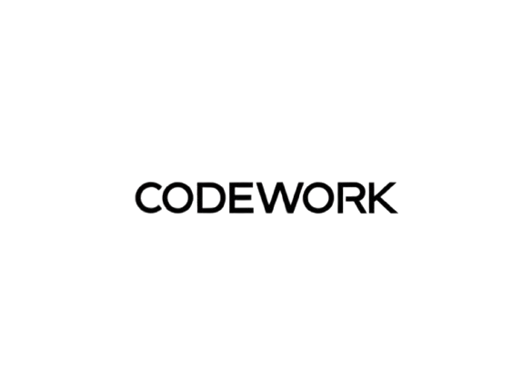

# CodeWork

<p align="center">
  
</p>

<h3 align="center">Desenvolvimento web de alta performance</h3>

<p align="center">
  Sites profissionais, sistemas personalizados e experiências digitais criadas para impulsionar negócios.
</p>

<p align="center">
  <a href="#sobre-o-projeto">Sobre</a> •
  <a href="#serviços">Serviços</a> •
  <a href="#tecnologias">Tecnologias</a> •
  <a href="#executar-localmente">Instalação</a> •
  <a href="#contato">Contato</a>
</p>

---

## Sobre o projeto

O **CodeWork** é um site institucional desenvolvido para apresentar os serviços, projetos e a proposta de valor da CodeWork. A experiência foi pensada para comunicar profissionalismo, facilitar a navegação e transformar visitantes em oportunidades de negócio.

A interface reúne identidade visual moderna, elementos interativos, animações sutis e layout responsivo para diferentes tamanhos de tela.

## Serviços

* **Sites e landing pages:** páginas responsivas, com foco em apresentação de marca e conversão.
* **Sistemas personalizados:** dashboards, painéis administrativos, CRMs e aplicações web sob medida.
* **SEO e performance:** otimização técnica para melhorar a experiência de navegação e a visibilidade nos mecanismos de busca.
* **Manutenção e correção:** suporte técnico, diagnóstico de problemas e melhorias contínuas.

## Recursos do site

* Apresentação institucional e chamada para orçamento.
* Seções de serviços, projetos, processo de trabalho e sobre a empresa.
* Portfólio visual com exemplos de soluções web.
* Perguntas frequentes com respostas expansíveis.
* Botões de contato integrados ao WhatsApp.
* Alternância entre temas claro e escuro.
* Animações e efeitos visuais.
* Layout adaptável a dispositivos móveis, tablets e desktops.
* Componentes organizados e reutilizáveis.

## Prévia

As imagens utilizadas na interface estão disponíveis no diretório `public/`, incluindo os arquivos de identidade visual e as imagens do portfólio.

## Tecnologias

| Tecnologia                                    | Utilização                              |
| --------------------------------------------- | --------------------------------------- |
| [React 19](https://react.dev/)                | Construção da interface por componentes |
| [TypeScript](https://www.typescriptlang.org/) | Tipagem estática e manutenção do código |
| [Vite](https://vite.dev/)                     | Servidor de desenvolvimento e build     |
| [Tailwind CSS](https://tailwindcss.com/)      | Estilização responsiva                  |
| [Framer Motion](https://motion.dev/)          | Animações e transições                  |
| [Lucide React](https://lucide.dev/)           | Ícones                                  |
| [ESLint](https://eslint.org/)                 | Padronização e análise estática         |

## Executar localmente

### Pré-requisitos

* Node.js (versão compatível com o Vite utilizado no projeto)
* npm

### 1. Clone o repositório

```bash
git clone https://github.com/brenodev2007/CodeWork.git
cd CodeWork
```

### 2. Instale as dependências

```bash
npm install
```

### 3. Inicie o servidor de desenvolvimento

```bash
npm run dev
```

O Vite exibirá no terminal o endereço local para abrir o projeto no navegador (normalmente `http://localhost:5173`).

## Scripts disponíveis

| Comando           | Descrição                                                    |
| ----------------- | ------------------------------------------------------------ |
| `npm run dev`     | Inicia o servidor de desenvolvimento                         |
| `npm run build`   | Executa a verificação TypeScript e gera a versão de produção |
| `npm run preview` | Executa uma prévia local do build                            |
| `npm run lint`    | Analisa o código com ESLint                                  |

## Estrutura do projeto

```text
CodeWork/
├── public/
│   ├── projects/          # Imagens do portfólio
│   ├── logo.png           # Identidade visual
│   ├── logo-dark.png
│   ├── logo-light.png
│   └── ...                # Demais imagens públicas
├── src/
│   ├── components/        # Seções e componentes da interface
│   ├── contexts/          # Contextos compartilhados (tema)
│   ├── assets/            # Recursos importados pelo código
│   ├── App.tsx            # Composição principal da aplicação
│   ├── App.css
│   ├── index.css
│   └── main.tsx           # Ponto de entrada
├── index.html
├── package.json
├── tailwind.config.js
├── tsconfig.json
└── vite.config.ts
```

## Build e publicação

Para gerar os arquivos otimizados para produção:

```bash
npm run build
```

O resultado será criado no diretório `dist/`. Esse diretório pode ser publicado em serviços de hospedagem estática compatíveis com aplicações Vite, como Vercel, Netlify ou GitHub Pages (com a configuração de base e roteamento adequada ao ambiente).

Antes de publicar, valide o build e confira se os caminhos dos recursos públicos estão corretos para o domínio de destino.

## Contato

Para solicitar um orçamento ou conversar sobre um projeto, entre em contato pelo WhatsApp:

[**Falar com a CodeWork**](https://wa.me/5511991067870)

---

<p align="center">
  Desenvolvido por <strong>Breno Soriani</strong> · CodeWork
</p>
